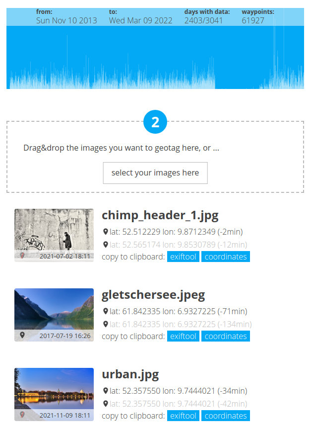

# geotagger-js
This is a small JavaScript tool to geotag your own photos, which in turn are derived from Google location history movement data. The tool can be called directly via the `geotagger-js.html` file. The `wp-geotagger-js.php` file can be included in a custom Wordpress theme and make the tool available there.

To read the EXIF data of the photos I use [Exif-js](https://github.com/exif-js/exif-js).

More about this and example: [entry in my blog (German)](https://blog.gestreift.net/knowhow/geotagging-mit-googles-standortverlauf/)

Read in other languages: [Deutsch](README.de-de.md)

## Installation as standalone tool
Download the directory `assets` and the file `geotagger-js.html` and place them exactly like this in a folder. If you now open the local file geotagger-js.html with the internet browser of your choice (e.g. file:///home/name/dir/geotagger-js.html), you should directly see this picture:


## Installation in a Wordpress theme
Load the directory `assets` and the file `wp-geotagger-js.php` into your theme directory. In the file `functions.php` geotagger-js is then included as follows:
```
require_once('geotagger-js/wp-geotagger-js.php');
```

From now on the tool can be included with the shortcode `[geotagger_js master_class="geotagger-js"]` on any page or post. The optional parameter `master_class` specifies the name of a CSS class in case the default class conflicts with the theme.

## Operation
Visit [Google Takeout](https://takeout.google.com/settings/takeout/custom/location_history) to download your location history. You'll need the data in JSON format. Google doesn't offer anything else as of today (March 2022) anyway. 

You can now load the JSON files from Google via drag & drop or via the file dialog. In the next step you can select one or more images.

If GPS data can be found in the Google dataset at least on the day the photo was taken, the tool will display the ones closest to the photo. With two buttons you can either copy the coordinates to the clipboard or use the appropriate 'exiftool' command with all parameters to store the GPS data in the EXIF record of the photo.


